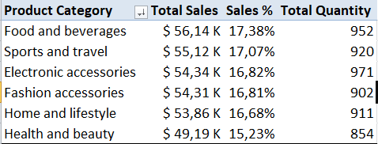
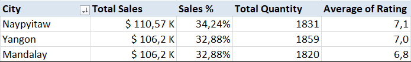
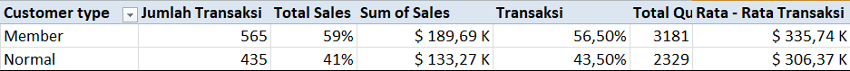
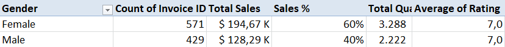
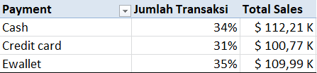
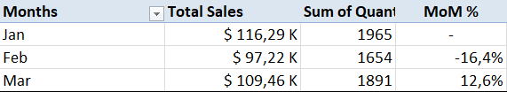
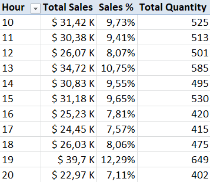
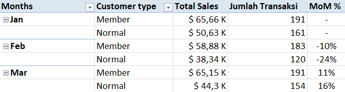
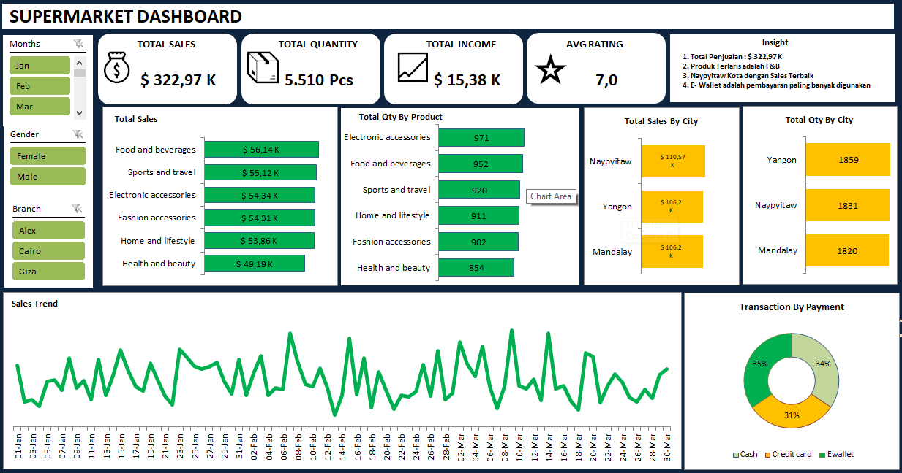

# Supermarket Sales Dataset | Microsoft-Excel

  > Project analisis end-to-end menggunakan Excel untuk menganalisis pola penjualan berdasarkan produk, segmen pelanggan, lokasi, metode pembayaran, dan periode waktu guna mengidentifikasi perbedaan performa penjualan serta area yang perlu diperhatikan dalam pengambilan keputusan bisnis.

Table Of Contents
1. Business Understanding
2. Data Source
3. Tool 
4. Data Cleaning
5. Sales Performance & Customer Segment Analysis.
6. Key Findings
7. Dashboard
8. Insight
9. Recommendations

## 1. Business Understanding

### 1.1 Business Background
Bisnis retail supermarket dengan beberapa cabang dan berbagai kategori produk. Perusahaan melayani pelanggan Member dan Normal melalui metode pembayaran Cash, Credit Card, dan Ewallet. Data transaksi digunakan untuk menganalisis performa penjualan berdasarkan produk, pelanggan, lokasi, pembayaran, dan periode waktu.

### 1.2 Business Problem
Manajemen supermarket belum memiliki gambaran yang jelas tentang di mana performa penjualan kuat dan di mana masih lemah. Penjualan berfluktuasi antar periode tanpa diketahui dimensi bisnis apa yang mendorongnya, dan belum diketahui apakah program membership berkaitan dengan nilai belanja yang lebih besar. Tanpa pemahaman ini, keputusan untuk mempertahankan atau meningkatkan area bisnis (produk, lokasi, segmen pelanggan, metode pembayaran) berisiko tidak tepat sasaran.

### 1.3 Project Objectives
  * Membandingkan pola penjualan berdasarkan segmen pelanggan, produk, lokasi, dan metode pembayaran.
  * Mengidentifikasi area yang perlu dipertahankan dan area yang berpotensi ditingkatkan.
  * Menganalisis perubahan sales antar bulan beserta dimensi bisnis yang berkontribusi.
  * Mengevaluasi pola pembelian dan efektivitas membership.
  * Menyusun rekomendasi bisnis berbasis temuan.
    
### 1.4 Business Questions
* Apakah terdapat perbedaan pola penjualan berdasarkan segmen pelanggan, produk, lokasi, dan metode pembayaran?
* Area mana yang perlu dipertahankan dan area yang perlu peningkatan?
* Bagaimana pola perubahan sales antar periode dan dimensi bisnis apa yang berkontribusi terhadap perbedaannya?
* Seberapa efektif membership dan pola pembelian pelanggan?

---

## 2. Data Source

| Dimensi | Keterangan |
| :--- | :--- |
| **Source** | Public Supermarket Sales Dataset |
| **Period** | Jan–Mar 2019 |
| **Records** | 1,000 transactions |
| **Coverage** | 3 branches, 3 cities, 6 product categories |
| **Key Dimensions** | Customer, Product, Location, Payment & Time |
| **Key Metrics** | Sales, Quantity, Gross Income & Rating |

## 3. Tools

## 4. Data Cleaning
Seluruh pembersihan data menggunakan Microsoft Excel, sehingga menghasilkan tabel-tabel bersih yang akan menjadi fondasi bagi analisis selanjutnya."

### 4.1 Strategi Pembersihan Data
  * Mengubah type data column unit price dan rating (Text to Numeric/Value) menggunakan formula 'Substitute' dan 'Value'.
  * Mengubah format Date menjadi MM/DD/YYYY menggunakan Text to Columns.
  * Melakukan recalculation pada kolom COGS berdasarkan Unit Price × Quantity
  * Menghitung kembali Tax 5% berdasarkan COGS × 5% karena ditemukan ketidaksesuaian pada sebagian nilai.
  * Menghitung kembali Sales/Total berdasarkan COGS + Tax 5%.
  * Menghitung kembali Gross Income berdasarkan Sales − COGS.
  * Menghitung kembali Gross Margin % berdasarkan Gross Income / Sales.
    
### 4.2 Audit Column
Melakukan data validation menggunakan pengecekan tipe data (ISNUMBER) untuk memastikan kolom numerik dan tanggal telah berhasil dikonversi.

 | |  |

## 5. Sales Performance Analysis & Metrics

### 5.1 Sales Performance Analysis
Analisis dilakukan berdasarkan beberapa dimensi bisnis yang tersedia dalam dataset, yaitu *product category*, *branch*,*city*, *customer type*, *gender*, *payment method*, dan *date*.

| No | Dimension | Metric yang dianalisis | Tujuan |
|----|-----------|------------------------|--------|
| 1 | **Product Category** | Total Sales, Sales Contribution %, Quantity | Menilai kontribusi dan performa tiap kategori produk | 
| 2 | **Branch & City** | Total Sales, Sales Contribution %, Quantity, Avg Rating | Membandingkan performa dan pengalaman pelanggan antar lokasi |
| 3 | **Customer Type** | Total Sales, Transaction Count, Quantity, Avg Per Transactions | Membandingkan nilai transaksi Member vs Normal |
| 4 | **Gender** | Total Sales, Transaction Count, Quantity, Avg Per Transactions | Mengidentifikasi pola pembelian Female vs Male | 
| 5 | **Payment Method** | Transaction Count, Total Sales, Sales Contribution % | Memahami preferensi pembayaran dan kontribusinya |
| 6 | **Month** | Total Sales, Transaction Count, Quantity, MoM Growth % | Melihat perubahan sales antar bulan (Jan-Mar) | 
| 7 | **Hour** | Transaction Count, Total Sales, Sales Contribution % | Menemukan jam puncak transaksi |
| 8 | **Month × Customer Type** | Total Sales, Transaction Count, Selisih antar bulan | Menemukan dimensi yang berkontribusi pada perubahan sales |
---

### 5.2 Performance Metrics
Metrik utama yang digunakan dalam analisis ini meliputi:

* **Total Sales:** Total amount pendapatan dari seluruh transaksi penjualan.
* **Total Quantity:** Total unit produk yang berhasil terjual.
* **Gross Income:** Total keuntungan kotor yang diperoleh.
* **Gross Margin %:** Persentase margin keuntungan kotor terhadap total penjualan.
* **Average Customer Rating:** Rata-rata skor kepuasan pelanggan (skala 1–10).
* **Sales Contribution %:** Persentase kontribusi penjualan dari setiap segmen/kategori terhadap total pendapatan.

## 6. Key Findings

### 6.1 Product Category Performance

* *Food and Beverages mencatatkan *sales* tertinggi sebesar $ 56,14 K dengan jumlah quantity sebesar 952 Pcs, sedangkan **Health and beauty** mencatat *sales* terendah sebesar $ 49,19 K dengan jumlah quantity 854 Pcs.*
> **Insight:** F&B merupakan produk utama yang mendorong penjualan

### 6.2 Performance by City

* *Naypyitaw menjadi kota dengan penjualan terbanyak sebesar $ 110,57 K dengan persentase kontribusi sales sebesar 34,24 % dan mempunyai rating tertinggi sebesar 7,1 dibanding kota Yangon dan Mandalay yang mempunyai sales hampir sama besar.*
 > **Insight:** Kota Naypyitaw menjadi kota dengan kontribusi penjualan terbesar dibanding kota Yangon dan Mandalay.

### 6.3 Customer Segment

* *Member menghasilkan *sales* sebesar $ 189,69 K (*volume* 3,181 unit), jauh lebih tinggi dibandingkan **Normal Customer** sebesar $ 133,27 K (*volume* 2,329 unit).*
 > **Insight:** Segmen *Member* merupakan pendorong utama kontribusi penjualan bisnis dengan rata - rata $ 335,74 Per Transaksi

* *Female menghasilkan *sales* sebesar $ 194,67 K (*volume* 3,288 unit), jauh lebih tinggi dibandingkan **Male** sebesar $ 128,29 K (*volume* 2,222 unit).*
 > **Insight:** Gender *Female* merupakan pendorong utama kontribusi penjualan bisnis.

### 6.4 Payment Behavior

* *Cash menjadi metode pembayaran utama dengan *sales* tertinggi sebesar **$112,206.57** dengan jumlah transaksi sebesar 34 % sedikit lebih sedikit dibanding dengan E - Wallet yang 35 %, diikuti oleh **Credit Card** sebesar **$100,767.07** dengan jumlah transaksi sebesar 31 %.*
 > **Insight:** Transaksi tunai (*Cash*) masih menjadi preferensi dominan pelanggan selama periode pengamatan.

### 6.5 Sales Trend (Monthly Performance)

* *Penjualan tertinggi terjadi pada Januari ($116,291.87), kemudian mengalami penurunan sebesar 16,4 % pada Februari ($97,219.37), sebelum akhirnya bangkit kembali pada Maret ($109,455.51).*
 > **Insight:** Performa penjualan menunjukkan pola fluktuasi periodik, bukan tren penurunan yang konsisten.

### 6.6 Sales Trend (Hours Performance)

* *Penjualan tertinggi terjadi pada Pukul 13.00 - 13.59  ($34,72 K) dan Pukul 19.00 - 19.59  ($39,70 K).* 
 > **Insight:** Performa penjualan menunjukkan pola sales by hours mengalami fluktuasi periodik.

### 6.7 Customer Type Per Month

* *Penjualan pada bulan februari terjadi penurunan oleh customer normal sebesar 24 % dibanding bulan januari namun meningkat sebesar 16 % pada bulan Maret* 
 > **Insight:** Penurunan sales Februari beriringan dengan penurunan jumlah transaksi, terutama pada Customer Normal, yang memberikan kontribusi besar terhadap penurunan sales.
  
## 7. Dashboard
Project ini dirancang sebagai analisis end-to-end yang membentuk satu alur cerita, mulai dari identifikasi business problem, eksplorasi data, penemuan insight, hingga penyusunan dasar rekomendasi bisnis.

## 8. Insight
1. Penjualan relatif merata antar kota (32,9-34,2%), produk (15,2-17,4%), dan metode pembayaran (31,2-34,7%), sehingga tidak ada satu dimensi yang terlalu dominan. Perbedaan paling jelas ada pada gender: Female menyumbang 60,3% total sales dan Male 39,7%. Dari sisi pembayaran, Cash memiliki sales tertinggi ($112,21K), sedangkan jumlah transaksi E-wallet dan Cash hampir sama (345 vs 344)
2.Naypyitaw dipertahankan karena sales ($110,57K) dan rating (7,1) tertinggi di antara kota lain. Yangon dan Mandalay memiliki potensi peningkatan. Yangon mencatat unit terjual tertinggi (1.859 pcs) tetapi total sales lebih rendah dan sales-nya paling fluktuatif antar bulan. Mandalay memiliki rating terendah (6,8) dibanding kota lainnya.
3. Sales turun 16,4% dari Januari ke Februari ($116,29K → $97,22K), lalu pulih 12,6% di Maret tetapi masih 5,9% di bawah Januari. Penurunan Februari terutama didorong oleh jumlah transaksi dari customer yang turun (1.965 → 1.654), dengan kontribusi terbesar dari pelanggan Normal (24 % dibanding januari).
4. Member cenderung membeli dengan nominal (rata-rata $336 vs $306 per transaksi) lebih besar daripada pelanggan Normal, meskipun selisih nominalnya bervariasi antar bulan. Dari sisi waktu, pembelian memuncak pada pukul 19:00 (12,29 % sales), disusul pukul 13:00 dan 15:00. Karena dataset tidak memiliki customer ID, temuan ini menunjukkan korelasi dan belum membuktikan bahwa membership yang menyebabkan belanja lebih besar.

## 9. Recommendations
1. Evaluasi potensi peningkatan nilai transaksi pelanggan Male melalui program promosi atau bundling yang dapat diuji. Keberhasilannya perlu diukur berdasarkan perubahan nilai transaksi dan jumlah transaksi.
2. Naypyitaw dapat digunakan sebagai acuan performa, sementara Yangon dan Mandalay perlu dievaluasi lebih lanjut berdasarkan dimensi yang menunjukkan perbedaan performa.
3. Uji coba promo pada awal Februari yang menyasar pelanggan Normal, kemudian ukur perubahan jumlah transaksi dan sales untuk mengevaluasi efektivitasnya.
4. Gunakan pola transaksi pukul 19:00 sebagai referensi untuk evaluasi kebutuhan staffing dan kesiapan operasional pada jam sibuk.

## 10. Limitations & Methodology Notes

> **Catatan Metodologi & Keterbatasan Data:**
> Beberapa batasan dan konteks metodologi yang perlu diperhatikan dalam menginterpretasikan hasil analisis proyek ini.

* **Cakupan Data Terbatas:** Dataset terbatas pada **1.000 transaksi** dalam rentang waktu Januari hingga Maret 2019.
* **Ketiadaan *Customer ID*:** Tidak terdapat variabel *Customer ID* unik, sehingga analisis tingkat individu seperti **RFM, Customer Lifetime Value (CLV), Churn, dan Retention** tidak dapat dilakukan.
* **Korelasi Lokasi:** Variabel *Branch* (Cabang) dan *City* (Kota) memiliki hubungan *1-to-1* (saling berpasangan secara identik) dalam dataset ini.
* **Sifat Analisis:** Temuan analisis ini bersifat **deskriptif dan diagnostik** (*descriptive/diagnostic*), bukan menunjukkan hubungan sebab-akibat (*causal relationship*).
* **Ketersediaan Data Operasional:** Tidak tersedia data pendukung seperti *inventory/stok*, biaya promosi, biaya pemasaran (*marketing cost*), maupun biaya operasional (*operational cost*).
* **Penggunaan *Customer Rating*:** Indikator *Customer Rating* digunakan hanya sebagai **indikator pendukung** (*supporting indicator*), bukan sebagai pemicu utama (*causal driver*) dari penjualan.

Dataset  : https://www.kaggle.com/datasets/faresashraf1001/supermarket-sales
